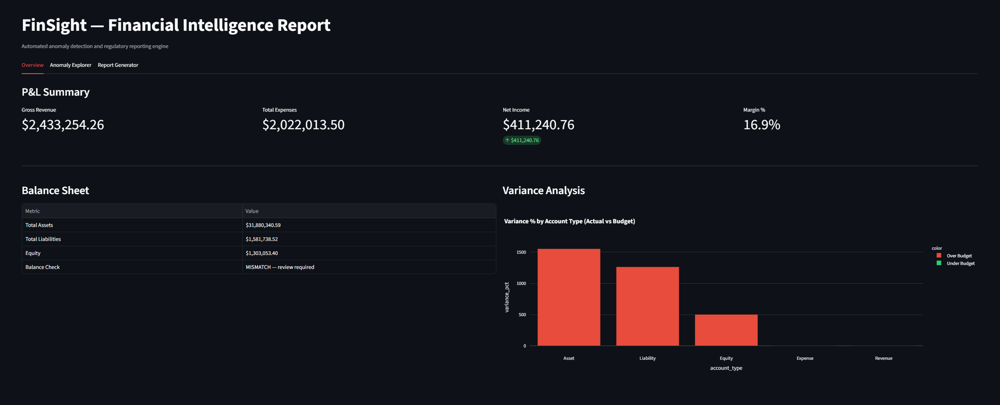

# FinSight

Financial anomaly detection and reporting engine that simulates what a Controllers
team at an investment bank does — ingest transaction data, flag irregularities,
and generate audit-ready reports.

## What it does

Runs 1,000 synthetic financial transactions through a three-layer detection pipeline:

- **Rule-based** — catches duplicates, negative values, invalid currencies
- **Statistical (Z-score)** — flags transactions deviating significantly from their account type's mean
- **Machine learning (Isolation Forest)** — unsupervised anomaly detection on debit/credit feature space

Results feed into a Streamlit dashboard with P&L summaries, balance sheet validation,
variance analysis, and a one-click PDF report generator.

## Stack

Python · Pandas · Scikit-learn · SQLAlchemy · SQLite · Streamlit · Plotly · ReportLab

## Structure

    finsight/
    ├── engine/
    │   ├── generator.py      # synthetic data generation + SQLite persistence
    │   ├── anomaly.py        # three-layer anomaly detection
    │   └── financials.py     # P&L, balance sheet, variance analysis
    ├── dashboard.py          # Streamlit UI
    ├── report.py             # PDF report generation
    └── main.py               # pipeline runner

## Run locally

    git clone https://github.com/ikshita22/Finsight.git
    cd Finsight
    pip install -r requirements.txt
    python main.py
    streamlit run dashboard.py

## Dashboard

**Overview** — P&L metrics, balance sheet with compliance status, variance bar
chart showing over/under budget by account type

**Anomaly Explorer** — scatter plot of all transactions with anomalies highlighted
in red, filterable table by detection method (rule-based, z-score, ML)

**Report Generator** — one-click PDF export with executive summary, financial
tables, and top 15 anomalous transactions sorted by debit amount